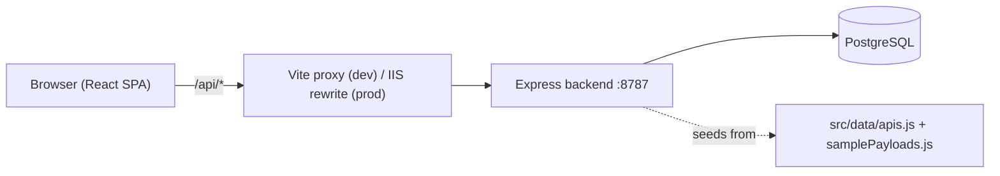

# CoAction Developer Workbench — Project Log

> A living record of the project's architecture, features, and every change made over time.
> **Convention:** Every time we do meaningful work (add a feature, fix a bug, change config,
> deploy, etc.), add a dated entry to the [Change Log](#change-log) at the bottom of this file.

- **Last updated:** 2026-09-09
- **Repository:** https://github.com/divyamrutha-2001/Coaction_Dev
- **App folder:** `coaction-developer-workbench-react/`

---

## 1. Overview

The CoAction Developer Workbench is an internal **API developer portal** for a P&C
(Property & Casualty) insurance company. It lets teams discover, publish, document, and
monitor internal APIs. It is a single-page React app backed by an Express API that reads and
writes to a PostgreSQL database.

The app is a React + Vite port of an earlier static HTML prototype.

---

## 2. Tech Stack

### Frontend
- **React 18.3** + **Vite 5.4** (SPA)
- **react-router-dom 7** — client-side routing
- **@tanstack/react-query 5** — server state / data fetching & caching
- **recharts** — dashboard & usage charts
- **lucide-react** — icons
- **Tailwind CSS 4** (+ `@tailwindcss/postcss`, `autoprefixer`, `tailwindcss-animate`)
- **next-themes** — light/dark theme provider
- **react-hook-form** + **zod** (`@hookform/resolvers`) — forms & validation
- **Radix UI** primitives (dialog, dropdown, select, tabs, toast, accordion, label, slot)
- **ag-grid-react** — data grid
- **sonner** — toast notifications
- **axios** — HTTP (available; app currently uses `fetch` in `apiClient.js`)

### Backend
- **Node.js** (ESM, `"type": "module"`)
- **Express 4** — HTTP API
- **pg** — PostgreSQL driver
- **dotenv** — environment config
- **cors** — cross-origin support

### Deployment / Ops
- **IIS** with URL Rewrite (`web.config`) as reverse proxy + SPA host
- **PM2** (`ecosystem.config.cjs`) for the backend process
- **node-windows** (`install-service.cjs`) to run the backend as a Windows Service

---

## 3. How to Run

From the `coaction-developer-workbench-react/` folder:

```powershell
npm install
```

| Command | What it does |
| --- | --- |
| `npm run dev` | Start Vite dev server (usually http://localhost:5173) |
| `npm run server` | Start the Express backend on port 8787 |
| `npm run dev:full` | Run frontend + backend together (via `concurrently`) |
| `npm run build` | Build the production frontend into `dist/` |
| `npm run preview` | Preview the production build |

Helper scripts:
- `start-workbench.ps1 -Mode dev|server|full` — convenience launcher
- `deploy-backend.ps1 -FrontendPath <path>` — `npm ci`, build, publish `dist/`, start PM2

> **Note:** The dev server proxies `/api` → `http://localhost:8787`, so the backend must be
> running for data to load in development.

---

## 4. Architecture



- In **development**, Vite proxies `/api` to the backend.
- In **production**, IIS rewrites `^api/(.*)` to `http://localhost:8787/api/{R:1}` and serves
  the built SPA with a fallback to `index.html`.

---

## 5. Project Structure

```
coaction-developer-workbench-react/
├─ index.html                     # SPA entry HTML
├─ package.json                   # scripts & dependencies
├─ vite.config.js                 # Vite + React plugin + /api proxy
├─ tailwind.config.js             # Tailwind config
├─ postcss.config.js              # PostCSS config
├─ web.config                     # IIS URL Rewrite (proxy + SPA fallback)
├─ ecosystem.config.cjs           # PM2 process config
├─ install-service.cjs            # node-windows service installer
├─ deploy-backend.ps1             # build + publish + PM2 deploy script
├─ start-workbench.ps1            # dev/server/full launcher
├─ .env / .env.example            # DB + server configuration
├─ backend/
│  ├─ server.js                   # Express API + DB seeding
│  ├─ daemon/                     # Windows service artifacts
│  └─ data/                       # backend data dir
├─ iis-deploy-bundle/             # prebuilt frontend bundle for IIS
└─ src/
   ├─ main.jsx                    # React entry (StrictMode)
   ├─ App.jsx                     # Router + providers
   ├─ index.css                   # global / Tailwind styles
   ├─ assets/                     # logo, images
   ├─ components/
   │  ├─ TopNav.jsx               # top navigation bar
   │  ├─ ExplainChip.jsx          # AI "Explain" chip (audience-aware)
   │  └─ EndpointListView.jsx     # per-operation accordion + explain
   ├─ data/
   │  ├─ apis.js                  # 15 seed APIs (mock catalog)
   │  ├─ explanations.js          # seed explanations by "METHOD /path" x audience
   │  └─ samplePayloads.js        # sample request/response bodies per API
   ├─ pages/
   │  ├─ Dashboard.jsx
   │  ├─ ApiLibrary.jsx
   │  ├─ Upload.jsx
   │  ├─ Download.jsx
   │  ├─ Tags.jsx
   │  ├─ Access.jsx
   │  ├─ Usage.jsx
   │  ├─ PolicyTrace.jsx
   │  └─ Direction2Demo.jsx
   └─ services/
      └─ apiClient.js             # fetch wrapper for the backend
```

---

## 6. Frontend

### Routing (`src/App.jsx`)
Wraps the app in `ThemeProvider` (next-themes) and `QueryClientProvider` (react-query).

| Route | Component | Purpose |
| --- | --- | --- |
| `/` | `Dashboard` | KPIs, calls-over-time chart, top consumers, lifecycle table |
| `/api-library` | `ApiLibrary` | Browse APIs, code samples (curl/node), explain, sample payloads |
| `/upload` | `Upload` | Multi-step wizard to publish a new API |
| `/download` | `Download` | Browse/download API artifacts and record downloads |
| `/tags` | `Tags` | Context tags & metadata; APIs grouped by domain |
| `/access` | `Access` | Admin access management (roles, users, status) |
| `/usage` | `Usage` | Usage & KPIs (bar/pie charts, weighted latency/error) |
| `/trace` | `PolicyTrace` | Request/policy trace viewer |
| `/direction2` | `Direction2Demo` | Demo of endpoint-accordion explain UX |

### Navigation (`src/components/TopNav.jsx`)
Logo + primary nav (Dashboard, API Library, Downloads, Context Tags, Admin Access, Usage & KPIs,
Trace), an **Upload API** button, and a signed-in user avatar (Divya M.).

### Pages (summary)
- **Dashboard** — 4 stat cards (Total APIs, Active, Consumers, Added This Month), an area
  chart of API calls over 7/30/90 days (deterministic seeded data), a Top Consumers bar list,
  and an API Lifecycle table. Data comes from `GET /api/apis`.
- **ApiLibrary** — method badges, generated `curl` and Node fetch snippets, expandable rows,
  and the audience-aware Explain experience using `explanations.js` + `samplePayloads.js`.
- **Upload** — 5-tab wizard (Basic Info → Documentation → Sample Payloads → Tags → Version)
  built with `react-hook-form`; validates JSON; posts to `POST /api/apis`, then navigates to
  the library on success.
- **Download** — artifact download page with domain/type filters + search; lists prior
  downloads and records new ones via `/api/downloads`.
- **Tags** — tag categories (Business Domain, Technical Type, Lifecycle, Security Level) and
  APIs grouped by domain.
- **Access** — user access table with role/status styling (mock user list).
- **Usage** — usage KPIs: bar chart of calls/errors, type-distribution pie, call-weighted
  average latency and error rate.
- **PolicyTrace** — trace viewer with method/status color coding and sample objects.
- **Direction2Demo** — demonstrates the per-operation accordion Explain pattern.

### Data (`src/data/`)
- **apis.js** — 15 mock APIs across domains **Submissions, Underwriting, Policy, Claims, Data
  Services** (Create Submission, Submission Status, Submission Documents, Appetite Check, Risk
  Score, Quote, Bind, Policy Lookup, Exposure, FNOL, Claim Status, Claim Reserve, Claim
  Payment, Loss Run, Reference Data). Also used by the backend to seed the DB.
- **explanations.js** — seed explanations keyed by `"METHOD /path"`, each in three audience
  registers: **Business, Developer, Partner**.
- **samplePayloads.js** — sample request/response JSON per API name (GET endpoints omit
  `request`).

### Service layer (`src/services/apiClient.js`)
Thin `fetch` wrapper exposing: `getApis()`, `createApi(payload)`, `getDownloads()`,
`createDownload(payload)`. Throws with the server's message on non-2xx responses.

---

## 7. Backend (`backend/server.js`)

Express server on `PORT` (default **8787**). Uses a `pg` connection pool and applies
`SET search_path TO <DB_SCHEMA>` per connection.

### Startup behavior
1. **`ensureSchema()`** — idempotently adds columns if missing: `tags_json jsonb`,
   `sample_request jsonb`, `sample_response jsonb` on `apis`.
2. **`seedDatabase()`** — if the row count doesn't match the seed set (or a spot-check
   lifecycle mismatch is found), clears `downloads` + `apis` and re-seeds from `src/data/apis.js`
   (+ `samplePayloads.js`).

### Endpoints
| Method | Path | Description |
| --- | --- | --- |
| GET | `/api/health` | Returns DB name + current schema |
| GET | `/api/apis` | List all APIs (`formatApiRow` normalizes columns) |
| POST | `/api/apis` | Create an API; requires `name`, `type`, `domain`, `owner` |
| GET | `/api/downloads` | List last 20 downloads (joined to `apis`) |
| POST | `/api/downloads` | Record a download; resolves `apiId` by name if needed |

### Resilience notes
Both `POST` handlers use **multi-attempt inserts** (`tryApiInsert`, `tryDownloadInsert`) that
try several column layouts so the code tolerates different/legacy DB schemas. `formatApiRow`
and `formatDownloadRow` read many possible column names with fallbacks.

---

## 8. Database Schema

PostgreSQL, schema selectable via `DB_SCHEMA` (default `public`).

**`apis`** — `id, api_id, name, version, lifecycle, type, description, owner, consumers,
status, published, endpoint, environment, restricted, created_at, updated_at`
(+ `tags_json`, `sample_request`, `sample_response` added at runtime by `ensureSchema()`).

**`downloads`** — `id, download_id, api_id, artifact_name, downloaded_by, created_at`.

---

## 9. Configuration / Environment

`.env` (see `.env.example`):

| Variable | Purpose | Default |
| --- | --- | --- |
| `PORT` | Backend port | `8787` |
| `DB_HOST` | PostgreSQL host | — |
| `DB_PORT` | PostgreSQL port | `5432` |
| `DB_NAME` | Database name | — |
| `DB_USER` | Database user | — |
| `DB_PASSWORD` | Database password | — |
| `DB_SCHEMA` | Schema / search_path | `public` |
| `DB_SSL` | `true` to enable SSL (relaxed cert check) | unset |

---

## 10. Deployment & Ops

- **`web.config`** — IIS URL Rewrite: proxy `^api/(.*)` → `http://localhost:8787/api/{R:1}`;
  SPA fallback rewrites all non-file/non-directory requests to `/index.html`.
- **`ecosystem.config.cjs`** — PM2 app `coaction-workbench-backend` running `backend/server.js`
  (fork mode, autorestart, `max_memory_restart: 300M`, `NODE_ENV=production`, `PORT=8787`).
- **`install-service.cjs`** — installs a Windows Service named **CoAction API** that runs the
  backend (via `node-windows`).
- **`deploy-backend.ps1`** — `npm ci` → `npm run build` → copy `dist/*` to a frontend path →
  `pm2 start ecosystem.config.cjs` → `pm2 save`.
- **`iis-deploy-bundle/`** — a prebuilt frontend bundle (`index.html`, `web.config`, `assets/`)
  ready to drop into an IIS site.

---

## 11. Known Issues / Notes / TODO

- `.env` and `.env.backup-*` are ignored by `.gitignore` and have been removed from Git's index
  while remaining available locally. If credentials were committed before this change, rotate
  them outside the repo.
- `README.md` has been refreshed to describe the current React Router app, 15 seed APIs,
  backend endpoints, and project-log convention.
- The **Download** and **Trace** pages are now exposed through top navigation; `Direction2Demo`
  remains an internal/demo route.
- Charts/metrics on Dashboard and Usage are **synthesized** from `consumers` counts and seeded
  randomness (not real telemetry).

---

## Change Log

Add a new dated entry at the top of this list for every meaningful change.

### 2026-09-09 — Resolve documentation and navigation TODOs
- Added `.env` and `.env.backup-*` to `.gitignore` and removed already tracked env files from
  Git's index while keeping them on disk locally.
- Updated `README.md` so it matches the current React Router app, backend setup, 15 seed APIs,
  routes, endpoints, and project-log convention.
- Added the `Download` page route at `/download` and exposed **Downloads** in the top nav.
- Exposed **Trace** in the top nav.
- Validated the app with `npm run build`; build passed with only Vite's large-chunk warning.
- Prepared the current workspace changes for commit and push to `origin/main`.

### 2026-09-09 — Baseline documentation
- Reviewed the entire project and created this `PROJECT_LOG.md`.
- Documented the tech stack, architecture, folder structure, all routes/pages, backend
  endpoints, DB schema, configuration, and deployment/ops.
- Recorded known issues: `.env` not gitignored, outdated `README.md`, unrouted `Download`
  page, and synthesized dashboard metrics.
